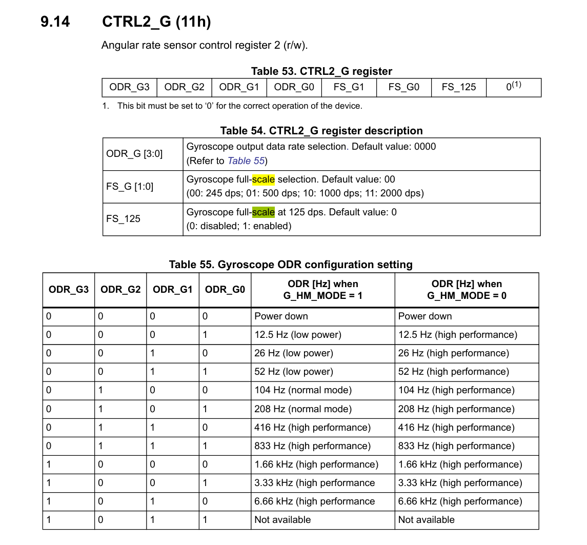

LSM6DS3 使用  

上电约20ms  
写CTRL10_C (19h) = 38h // Gyro X、Y、Z轴使能  
写CTRL2_G (11h) = 60h // Gyro  = 416Hz（高性能模式）  
写INT1_CTRL (0Dh) = 02h // INT1上，Gyro 数据准备就绪中断  
写CTRL3_C (12h) = 04h // IF_INC = 1，自动地址增量  

读取OUTX_L_G (22h) 到 OUTZ_H_G (27h) 共6字节数据  
地址为7位，最高位为R/NW位
  
